# Ethos Funnel Screen Capture

Captured: 2026-04-01

---

## Screen 1

**URL:** https://www.ethos.com/

### What the user sees

**Hero Section**
Heading: "Protect your family in minutes"
Subtext describing a quick, easy life insurance process. Three trust icons displayed horizontally: "15 minutes" (clock icon), "No medical exam" (checkmark icon), and a third badge (star/award icon). Social proof element showing "4.8★" rating and a user count (e.g., "50,000+ families protected").

**Value Proposition Section**
Heading: "The #1 no medical exam, instant life insurance provider"
Three bullet points with checkmark icons listing key benefits (e.g., instant approval, no exam required, affordable rates).

**Secondary Section**
Heading: "We cover you. You cover them."
Brief supporting copy about coverage for loved ones. A coverage amount or plan visual.

**"Life Insurance made easy" Section**
Step-by-step process breakdown (3–4 steps), each with an icon and short label (e.g., "Answer a few questions," "Get your rate," "Get covered today").

**Free Wills & Trusts Banner**
Highlighted section promoting a free will/trust offer bundled with the policy. Shows a phone mockup image.

**FAQ Section**
Heading: "FAQs"
Several collapsed accordion-style questions about the product.

**"Lock in your best price today" CTA Section**
Repeated call-to-action with a button.

**Footer**
Legal disclaimers, links (Privacy Policy, Terms, etc.), and company information in small text.

---

### What the user can do

- **Primary CTA button** (Hero) — "Get my price" or similar — initiates the quote funnel
- **Secondary CTA button** (bottom of page) — "Get my price" or similar — repeated entry point to the funnel
- **FAQ accordion items** — expandable/collapsible questions; user can click each to reveal the answer
- **Navigation links** (top header) — likely includes logo link (home) and possibly a login or menu link
- **Footer links** — Privacy Policy, Terms of Service, and other legal/informational links

---

## Screen 2

**URL:** https://www.ethos.com/

### What the user sees

A full marketing/landing page for **Ethos** life insurance, structured in several vertical sections:

**Top navigation bar**
- Ethos logo (left)
- Links: "Term Life", "Whole Life", "Learn", "About"
- Buttons: "Log in", "Check my price" (green CTA)

**Hero section**
- Headline: "Protect your family in minutes"
- Subtext: "No medical exam required. Instant decisions."
- Trust badges: Google Reviews stars, "4.9 stars / 2,800+ reviews"; BBB accredited logo
- Green CTA button: "Check my price"
- Visual: Phone mockup showing an insurance app screen with a policy summary

**"No medical exam" section**
- Headline: "The #1 no medical exam, instant life insurance"
- Subtext: "We understand you're busy and your time is limited, so you can get covered today."
- A list of feature checkmarks (text partially visible at this resolution)

**"Life insurance made easy" section**
- Headline: "Life insurance made easy"
- Three numbered steps with brief descriptions (text small/partially legible)
- Green CTA button: "Get started"

**App download section**
- "Free Wills & Trusts" banner
- App store badge (Apple App Store)
- Phone mockup showing the Ethos mobile app

**FAQs section**
- Heading: "FAQs"
- Several accordion-style questions listed (text not fully legible at this resolution)

**Bottom CTA section**
- Dark background with headline: "Lock in your best price today"
- Green button: "Check my price"

**Footer**
- Multiple columns of navigation links (products, company, resources)
- Legal/compliance disclaimer text
- Copyright notice

---

### What the user can do

- **"Check my price"** (green button, hero section) — primary CTA to start the insurance quote funnel
- **"Log in"** (top nav) — access existing account
- **"Term Life"**, **"Whole Life"**, **"Learn"**, **"About"** (top nav links) — navigate to product/info pages
- **"Get started"** (green button, "life insurance made easy" section) — secondary CTA into the funnel
- **App Store badge** — download the Ethos mobile app
- **FAQ accordion items** — expand/collapse individual FAQ answers
- **"Check my price"** (green button, bottom CTA section) — third entry point into the quote funnel
- **Footer links** — navigate to various informational and legal pages

---

## Screen 3

**URL:** https://app.ethos.com/q/goals

### What the user sees
- **Header:** "ETHOS" logo (top left) and "NEED HELP? (415) 915-0665" (top right)
- **Heading:** "Let's get started! What are your goals for life insurance?"
- **Subtext:** "Select all that apply."
- **Four selectable options**, each with an icon and label:
  1. "Protect my loved ones" (icon: two people)
  2. "Leave an inheritance" (icon: hand with coin)
  3. "Cover my funeral expenses" (icon: shield with checkmark)
  4. "I'm not sure" (icon: hand with question gesture)
- All options are unselected (empty radio/checkbox circles on the right)

### What the user can do
- **"Protect my loved ones"** — selectable option (checkbox/radio); choose this goal
- **"Leave an inheritance"** — selectable option; choose this goal
- **"Cover my funeral expenses"** — selectable option; choose this goal
- **"I'm not sure"** — selectable option; choose this if goal is unclear
- **"Next" button** (bottom, full-width, gray/disabled) — advances to the next step once at least one option is selected
- **Phone number "(415) 915-0665"** (top right) — tap to call for help

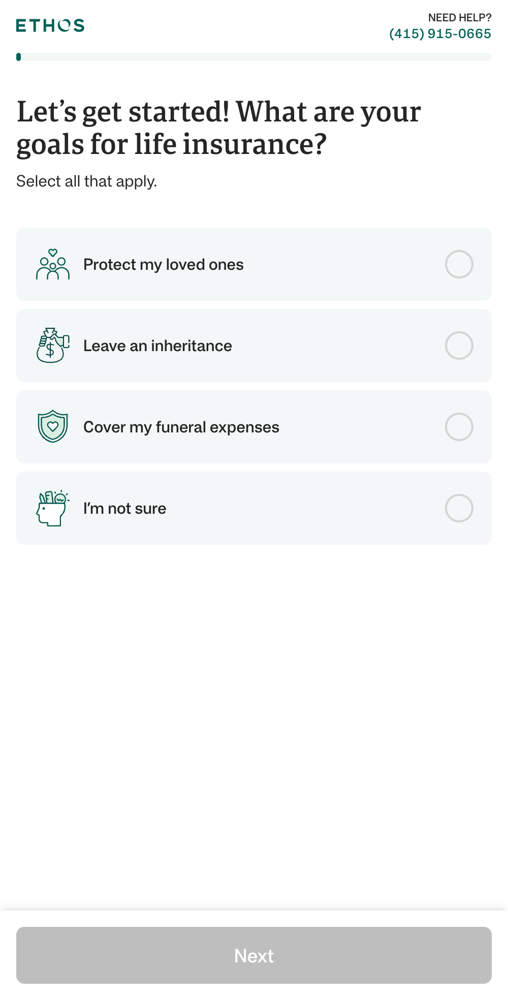

---

## Screen 4

**URL:** https://app.ethos.com/q/protections

### What the user sees
- **Header**: "ETHOS" logo centered at the top; back arrow (←) on the left; "NEED HELP? (415) 915-0665" on the right
- **Progress indicator**: A thin green progress bar near the top of the screen
- **Heading**: "Who depends on you financially?"
- **Subheading**: "This helps us customize your plan. Select all that apply."
- **Four selectable options**, each with an icon and label:
  1. Spouse or partner (icon: two figures)
  2. Children (icon: adult with child)
  3. Parent (icon: two figures, different style)
  4. Other (icon: heart/hands)

### What the user can do
- **← Back button**: Navigate to the previous screen
- **Phone number link** "(415) 915-0665": Call for help
- **"Spouse or partner" checkbox/radio**: Select this dependent type
- **"Children" checkbox/radio**: Select this dependent type
- **"Parent" checkbox/radio**: Select this dependent type
- **"Other" checkbox/radio**: Select this dependent type (multiple selections allowed per "Select all that apply.")
- **"Next" button** (bottom, full-width, gray/disabled state): Proceed to the next screen once at least one option is selected

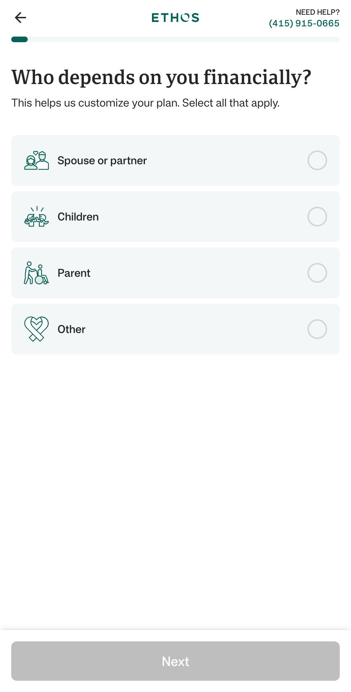

---

## Screen 5

**URL:** https://app.ethos.com/q/howItWorks

### What the user sees
A progress/intro screen with a motivational heading and a 3-step process overview.

- **Top bar:** Back arrow (left), "ETHOS" logo (center), "NEED HELP? (415) 915-0665" (right)
- **Heading:** "Great! We'll get your final rate in minutes."
- **Tag/pill:** "HOW IT WORKS" (outlined pill button/label below the heading)
- **3-step process list:**
  1. (active, filled green circle) "Tell us about your needs"
  2. (inactive) "Add your basic details"
  3. (inactive) "Provide health info and get your final rate"
- **Testimonial card:** Large green quotation mark icon, quote text: *"Holy cow! I'm still blown away by how easy this was."*, attributed to "Tim Witte" with a Google logo and 5 gold stars
- **Bottom CTA button:** Black pill button labeled "Next: Coverage Needs"

### What the user can do
- **Back arrow** — navigate to the previous screen
- **"NEED HELP? (415) 915-0665"** — tap to call support
- **"HOW IT WORKS" pill** — tap to learn more about the process (informational link/button)
- **"Next: Coverage Needs" button** — advance to the next step in the funnel (coverage needs selection)

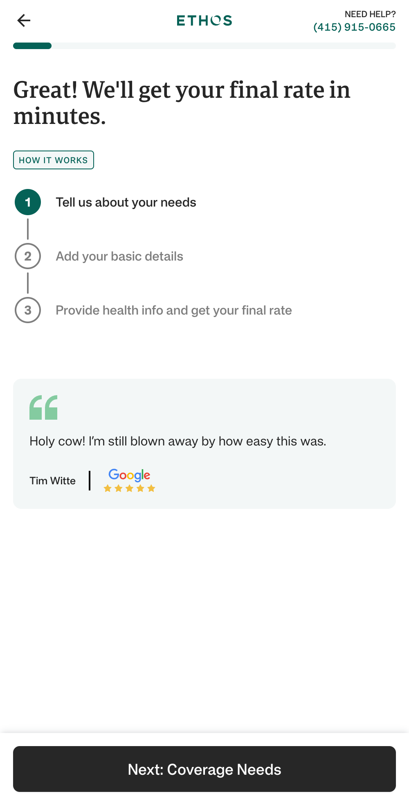

---

## Screen 6

**URL:** https://app.ethos.com/q/intent

### What the user sees
- **Header**: "ETHOS" logo centered at top; "NEED HELP? (415) 915-0665" in the top-right corner; a back arrow (←) in the top-left
- **Progress bar**: A partially filled green bar near the top, indicating early-to-mid funnel progress
- **Question heading** (large, bold): "When would you like to be covered by life insurance?"
- **Four answer options** displayed as full-width selectable tiles, each with light background:
  1. "I'm ready today"
  2. "Within a week"
  3. "In a few months"
  4. "I'm not sure"

### What the user can do
- **← Back button** (top-left): Navigate to the previous screen
- **NEED HELP? (415) 915-0665** (top-right): Tap to call support
- **"I'm ready today"** tile: Select this answer to indicate immediate coverage intent
- **"Within a week"** tile: Select this answer to indicate coverage needed within a week
- **"In a few months"** tile: Select this answer to indicate coverage needed in a few months
- **"I'm not sure"** tile: Select this answer if undecided on timing

Selecting any tile advances the funnel to the next step (no separate submit button).

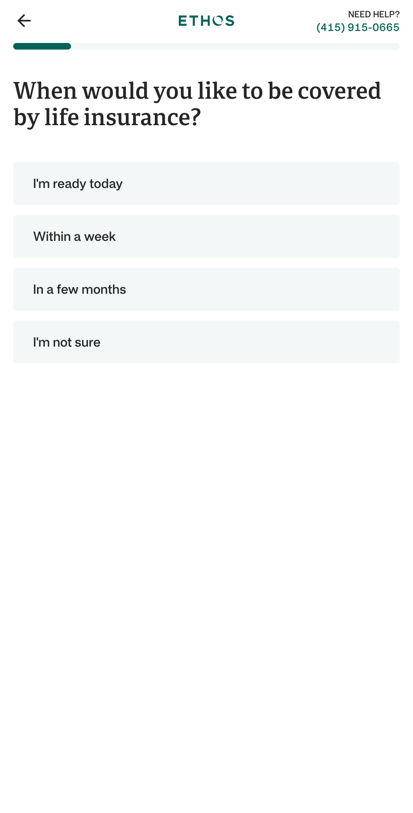

---

## Screen 7

**URL:** https://app.ethos.com/q/gender

### What the user sees
- **Header:** "ETHOS" logo centered at the top; "NEED HELP? (415) 915-0665" in the top-right corner; a back arrow ("←") in the top-left.
- **Progress bar:** A thin bar near the top of the screen, partially filled (approximately 20–25% complete), indicating funnel progress.
- **Heading:** "Provide your sex at birth" — large, bold, left-aligned.
- **Two answer options** displayed as full-width rectangular cards on a light gray background:
  - "Male"
  - "Female"

### What the user can do
- **← Back button** (top-left): Navigate to the previous screen.
- **"NEED HELP? (415) 915-0665"** (top-right): Tap to call support.
- **"Male" option card**: Select "Male" as sex at birth; tapping advances the funnel.
- **"Female" option card**: Select "Female" as sex at birth; tapping advances the funnel.

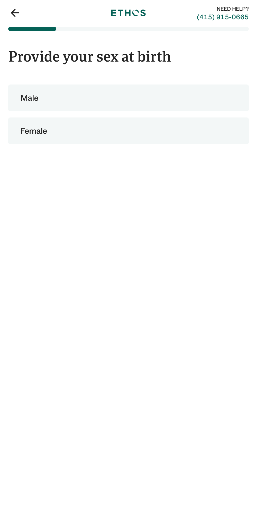

---

## Screen 8

**URL:** https://app.ethos.com/q/children

### What the user sees
- **Header**: "ETHOS" logo centered at top; "NEED HELP? (415) 915-0665" in the top-right corner
- **Progress bar**: Partially filled green bar near the top, indicating progress through the funnel
- **Heading**: "How many children do you have under 18?"
- **Subtext**: "This helps us estimate your family coverage needs."
- **Answer options** (displayed as full-width selectable rows): 0 / 1 / 2 / 3 / 4+

### What the user can do
- **Back arrow** (top-left): Navigate to the previous screen
- **"NEED HELP? (415) 915-0665"** (top-right): Call Ethos support
- **"0" option button**: Select zero children under 18
- **"1" option button**: Select one child under 18
- **"2" option button**: Select two children under 18
- **"3" option button**: Select three children under 18
- **"4+" option button**: Select four or more children under 18

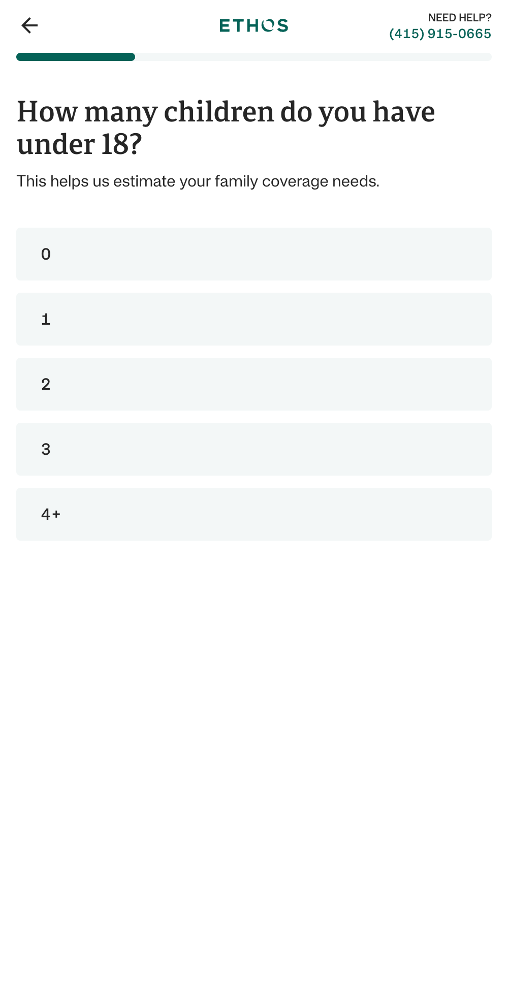

---

## Screen 9

**URL:** https://app.ethos.com/q/wills

### What the user sees
The Ethos logo appears centered at the top of the screen, with a back arrow on the left and "NEED HELP? (415) 915-0665" on the top right. A thin green progress bar spans the top, approximately one-third filled. The main heading reads: **"Do you have an Estate Plan or Will in place?"** Three answer options are displayed as full-width cards below the heading.

### What the user can do
- **Back arrow** (top left) — navigate to the previous screen
- **"(415) 915-0665"** (top right) — tap to call Ethos support
- **"Yes"** option card — select to indicate they have an Estate Plan or Will
- **"No"** option card — select to indicate they do not have one
- **"I'm not sure"** option card — select if they are uncertain

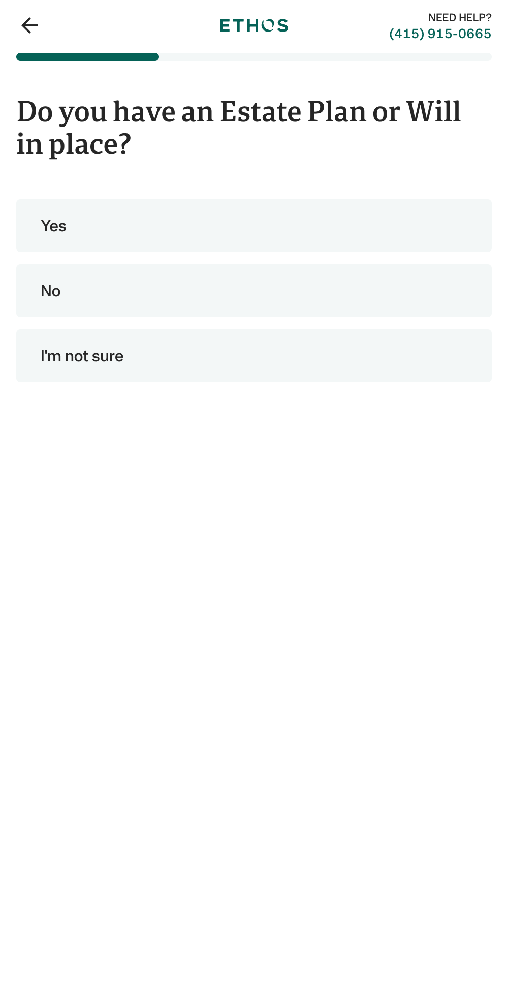

---

## Screen 10

**URL:** https://app.ethos.com/q/willsEducational

### What the user sees
- **Header**: "ETHOS" logo centered at top; "NEED HELP? (415) 915-0665" in the top-right corner; a back arrow ("←") in the top-left
- **Headline**: "Eligible policies include Estate Planning Tools" (large, bold, two lines)
- **Body text**: "These tools are provided at no additional cost, and can help you plan for your family's future." followed by a small info icon (ⓘ)
- **Illustration**: A teal/dark green illustration of a family (two adults and a child) standing in front of a house, sheltered under a large umbrella

### What the user can do
- **Back arrow (←)**: Navigate to the previous screen
- **Info icon (ⓘ)**: Tap to get more information about Estate Planning Tools
- **"Next" button**: Large dark button at the bottom of the screen; advances to the next step in the funnel
- **Phone number "(415) 915-0665"**: Tap to call for help

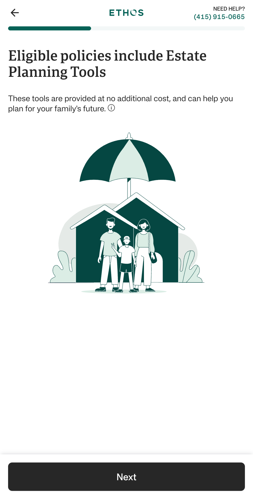

---

## Screen 11

**URL:** https://app.ethos.com/q/mortgageDebtAmounts

### What the user sees
- **Header**: "ETHOS" logo centered at the top, back arrow (←) on the left, "NEED HELP? (415) 915-0665" on the right
- **Progress bar**: Thin green bar near the top indicating funnel progress
- **Question heading**: "About how much remaining debt/mortgage do you have?"
- **Field label**: "Debt/mortgage amount"
- **Current value display**: "$0" shown in large text
- **Slider**: A horizontal range slider positioned at the far left (minimum), spanning from "$0" to "$1M+"
- **Info callout**: A light blue/gray box with an info icon containing the text: "Getting an estimate of your debt helps us understand your coverage needs."

### What the user can do
- **Back arrow (←)**: Navigate to the previous screen
- **"NEED HELP? (415) 915-0665" link**: Tap to call support
- **Debt/mortgage amount slider**: Drag to select a dollar amount ranging from $0 to $1M+; currently set to $0
- **"Next" button**: Large black button at the bottom; submits the selected debt amount and advances to the next screen

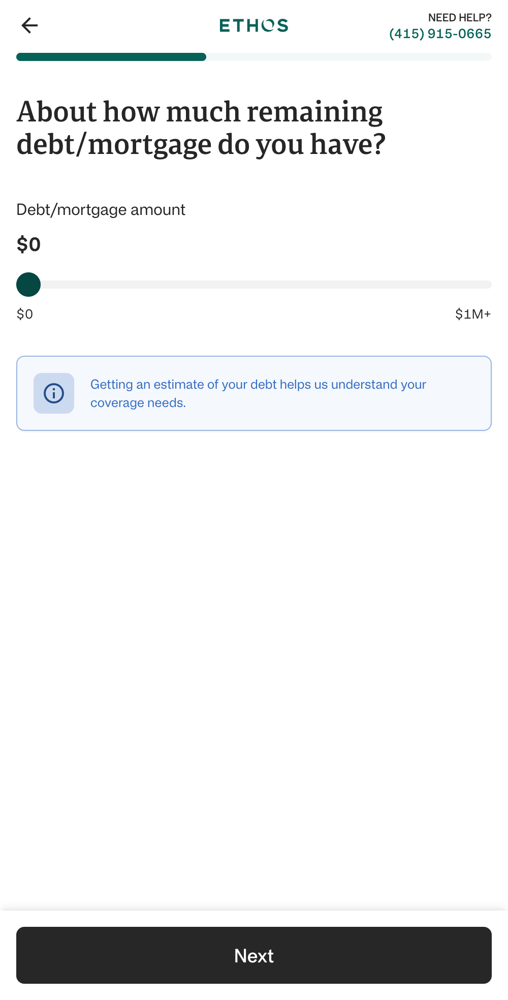

---

## Screen 12

**URL:** https://app.ethos.com/q/recommendation

### What the user sees

**Header:** "ETHOS" logo centered, back arrow (←) top-left, "NEED HELP? (415) 915-0665" top-right. A green progress bar runs below the header.

**Headline:** "Term life insurance sounds like a good fit!"

**Body copy:** "A Term Life policy helps cover your financial obligations, like debt and children's tuition, for a set period of time (term) at a fixed monthly price."

**"PROTECTION FOR" section:** Two icons in a card — "Spouse or partner" and "Children" — indicating who the selected coverage protects.

**Secondary headline:** "Here's how this coverage protects your partner and children"

**Explanatory text:** "If you were to die during your policy term length, they would get a lump-sum payout that can help cover the following things:"

**Coverage benefit list (partially visible):**
- **Living expenses** — "Covering everyday costs like groceries and bills helps ensure your family's daily needs are met."
- **Children's tuition costs** — "The cost of higher education can range from $50k to $200k+ per child."
- **Mortgage coverage** — "Covering large debts like your mortgage ensures your loved ones aren't left with the bill."
- **Estate planning** — (partially cut off, not fully visible)
- **Burial costs** — "Funeral costs in the US range from $7,000 to $12,000+."

### What the user can do

- **"Next" button** — large black full-width button at the bottom; advances to the next step in the funnel.
- **Back arrow (←)** — top-left; navigates to the previous screen.
- **"(415) 915-0665" link** — top-right; taps to call for help.
- **Scroll** — the benefit list appears to continue below the visible area (Estate planning item is cut off), so the user can scroll down to see more content.

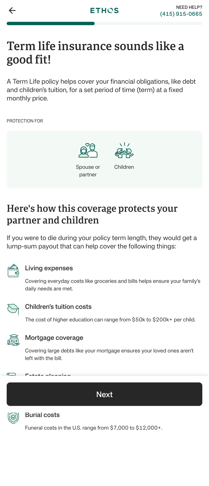

---

## Screen 13

**URL:** https://app.ethos.com/q/recommendation

### What the user sees

**Header:** "ETHOS" logo centered at top, with "NEED HELP? (415) 915-0003" in the top-right corner and a back arrow (←) in the top-left.

**Headline:** "Term life insurance sounds like a good fit!"

**Body copy:** "A Term Life policy helps cover your financial obligations, like debt and children's tuition, for a set period of time (term) at a fixed monthly price."

**Section label:** "PROTECTION FOR"

**Beneficiary icons (visual cards):** Two illustrated icons displayed side by side:
- "Spouse or partner"
- "Children"

**Explanatory sentence:** "If you were to die during your policy term length, they would get a lump-sum payout that can help cover the following things:"

**Benefit list (5 items, each with an icon):**
1. **Living expenses** — "Covering everyday costs like groceries and bills helps ensure your family's daily needs are met."
2. **Children's tuition costs** — "The cost of higher education can range from $50k to $200k+ per child."
3. **Mortgage coverage** — "Covering large debts like your mortgage ensures your loved ones aren't left with the bill."
4. **Estate planning** — "An estate plan can cost up to $500 plus additional lawyer fees. Create a will and trust for free with your Ethos policy."
5. **Burial costs** — "Funeral costs in the U.S. range from $7,000 to $12,000+."

### What the user can do

- **Back arrow (←):** Navigates to the previous screen.
- **"Next" button (black, full-width):** Advances to the next step in the funnel.

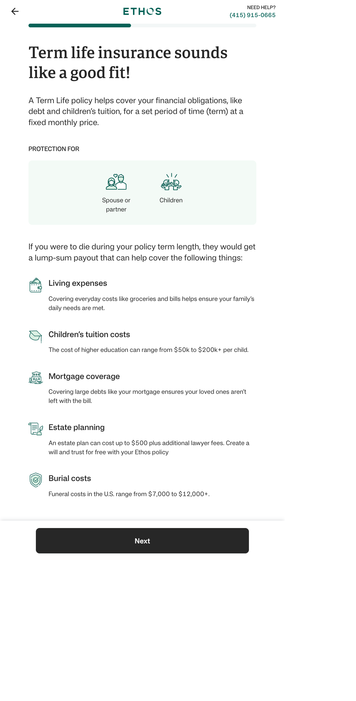

---

## Screen 14

**URL:** https://app.ethos.com/q/confirmEligibility

### What the user sees
A confirmation/transition screen with a celebratory heading: **"You've moved a step closer to securing your family!"**

Below the heading, a 3-step progress indicator shows the user's position in the funnel:
1. ~~Tell us about your needs~~ (checkmark — completed)
2. **Add your basic details** (highlighted with teal circle — current step)
3. Provide health info and get your final rate (upcoming, grayed out)

A Trustpilot testimonial card is displayed beneath the steps, featuring a large green quotation mark icon and the text:
> *"The ease of answering questions...and instant decision on approval is game changing. Love it!"*
> — **Maestra A.** | Trustpilot logo + 5-star rating (green stars)

The Ethos logo appears at the top center. A "NEED HELP? (415) 915-0665" link is in the top right corner.

### What the user can do
- **"Next: Basic Details" button** (black, full-width, bottom of screen) — advances to step 2 of the funnel
- **"NEED HELP? (415) 915-0665"** (top right) — tappable phone number to call support
- **Back arrow** (top left) — navigates to the previous screen

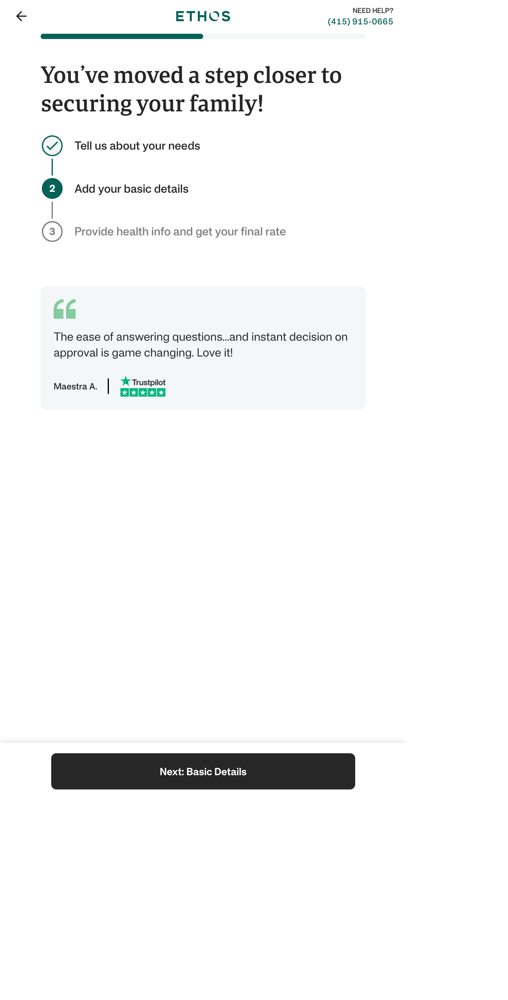

---

## Screen 15

**URL:** https://app.ethos.com/q/birthCountry

### What the user sees
- **Header**: "ETHOS" logo centered at the top; "NEED HELP? (415) 915-0665" in the top-right corner; a back arrow in the top-left
- **Progress bar**: Partially filled teal bar spanning most of the top, indicating significant progress through the funnel
- **Heading**: "What country were you born in?" (large, bold)
- **Field label**: "Country" (small, above the dropdown)
- **Dropdown**: Currently shows "United States" as the selected value

### What the user can do
- **Back arrow** (top-left): Navigate to the previous screen
- **"(415) 915-0665" phone link** (top-right): Call Ethos support
- **"Country" dropdown**: Select a country of birth; currently pre-filled with "United States"
- **"Next" button** (dark, full-width, bottom): Submit the selected country and advance to the next step

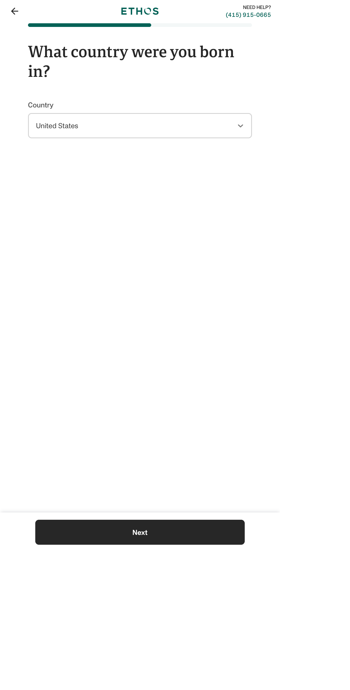

---

## Screen 16

**URL:** https://app.ethos.com/q/birthState

### What the user sees
- **Header**: "ETHOS" logo centered at the top; "NEED HELP? (415) 915-0665" in teal on the top right; a back arrow on the top left
- **Progress bar**: A teal progress bar spanning roughly 55% of the screen width, indicating funnel progress
- **Heading**: "What state were you born in?" in large bold text
- **Field label**: "State" in small gray text above the dropdown
- **Dropdown**: Currently showing "California (CA)" as the selected value, with a teal border indicating it is active/focused

### What the user can do
- **Back arrow** (top left): Navigate to the previous screen
- **"(415) 915-0665" link** (top right): Call Ethos support
- **State dropdown** labeled "State": Select a U.S. state from a list; currently set to "California (CA)"
- **"Next" button** (bottom, full-width, dark/black): Submit the selected state and advance to the next step

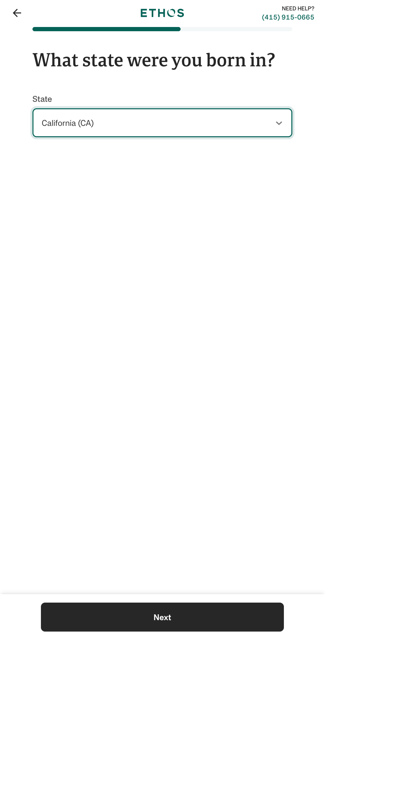

---

## Screen 17

**URL:** https://app.ethos.com/q/citizen

### What the user sees
The screen displays the **ETHOS** logo centered at the top, with a back arrow on the left and "NEED HELP? (415) 915-0665" in teal on the right. A teal progress bar spans roughly half the width of the screen beneath the header.

The main heading reads: **"Are you a citizen or permanent resident of the USA?"** in large, bold dark text.

Below the heading are three selectable options displayed as light gray bordered cards, each with left-aligned text:
1. **U.S. Citizen**
2. **Permanent Resident (Green Card)**
3. **None of the above**

### What the user can do
- **Back arrow (top left)** — navigates to the previous screen
- **"(415) 915-0665" link (top right)** — calls Ethos support
- **"U.S. Citizen" option card** — selects U.S. Citizen as citizenship status; advances the funnel
- **"Permanent Resident (Green Card)" option card** — selects Permanent Resident as citizenship status; advances the funnel
- **"None of the above" option card** — selects neither status; likely triggers a disqualification or alternative flow

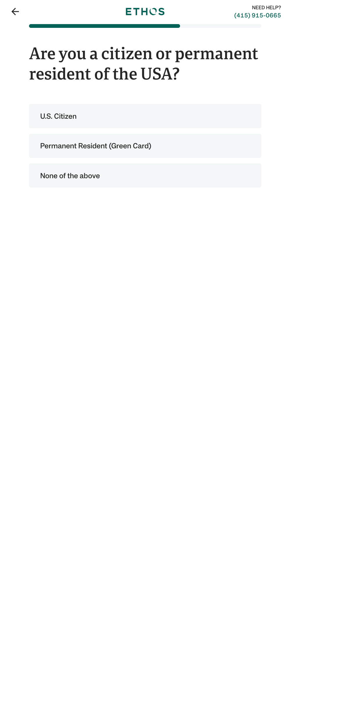

---

## Screen 18

**URL:** https://app.ethos.com/q/zipCode

### What the user sees
- **Header**: "ETHOS" logo centered at the top; "NEED HELP? (415) 915-0665" in the top-right corner; back arrow in the top-left
- **Progress bar**: A teal/green bar spanning most of the width, indicating near-completion of the funnel
- **Main heading**: "What's your zip code?" in large bold text
- **Field label**: "Zip code" in small gray text above an empty input field

### What the user can do
- **Back arrow** (top-left): Navigate to the previous screen
- **Phone link** "(415) 915-0665": Call Ethos support
- **Zip code text input**: Enter a 5-digit zip code; currently empty
- **"Next" button** (bottom, full-width, dark/black): Submit the zip code and proceed to the next step

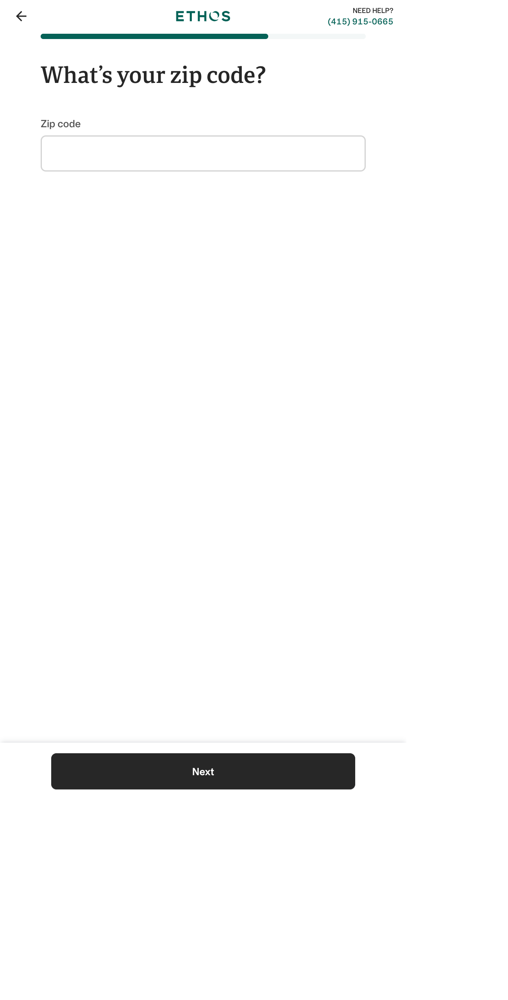

---

## Screen 19

**URL:** https://app.ethos.com/q/birthDate

### What the user sees
- **Header**: "ETHOS" logo centered at the top; "NEED HELP? (415) 915-0665" in the top-right corner; a back arrow in the top-left
- **Progress bar**: A teal/green bar near the top, approximately 75% filled
- **Heading**: "What's your birthdate?" (large, bold)
- **Date input field**: An empty text field with a calendar icon and placeholder text "mm/dd/yyyy"

### What the user can do
- **Back arrow** (top-left): Navigate to the previous screen
- **(415) 915-0665** (top-right): Tap to call for help
- **Date input field**: Enter birthdate in mm/dd/yyyy format; the calendar icon may open a date picker
- **"Next" button** (bottom, full-width, dark/black): Submit the entered birthdate and advance to the next step

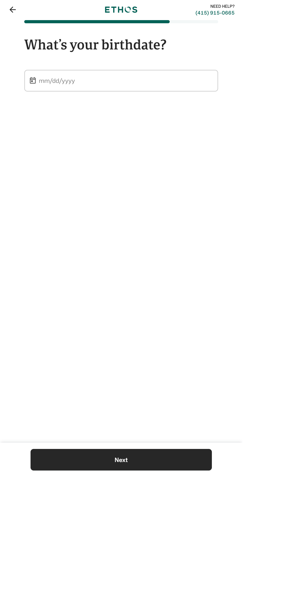

---

## Screen 20

**URL:** https://app.ethos.com/q/name

### What the user sees
- **Header:** "ETHOS" logo centered at top; "NEED HELP? (415) 915-0665" in the top-right corner; back arrow in the top-left; a thin teal progress bar below the header indicating progress through the funnel.
- **Heading:** "What's your name?"
- **Subtext:** "This helps us verify your identity so you can **get your final rate**, not just an estimate." ("get your final rate" is a teal-colored link.)
- **Form fields:** Two labeled text inputs — "Legal first name" and "Legal last name" — each with a lock icon on the right side.
- **Security note:** A lock icon followed by "We use secure encryption to protect your data."

### What the user can do
- **Back arrow (top-left):** Navigate to the previous screen.
- **"get your final rate" link:** Tappable inline link; likely explains why identity verification is needed.
- **"Legal first name" text input:** Enter the user's legal first name.
- **"Legal last name" text input:** Enter the user's legal last name.
- **"Next" button (black, full-width):** Submit the name and proceed to the next step.
- **"(415) 915-0665" phone number (top-right):** Call Ethos for help.

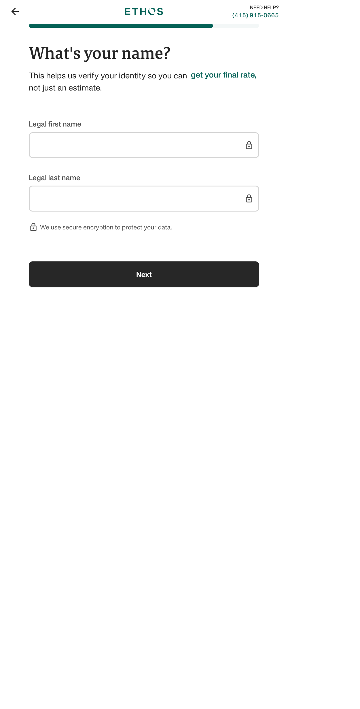

---

## Screen 21

**URL:** https://app.ethos.com/q/name

### What the user sees
- **Header:** "ETHOS" logo centered at the top; "NEED HELP? (415) 915-0665" in the top-right corner; back arrow in the top-left; teal progress bar near full completion beneath the header
- **Heading:** "What's your name?"
- **Subtext:** "This helps us verify your identity so you can **get your final rate**, not just an estimate." ("get your final rate" is a teal hyperlink)
- **Field label:** "Legal first name" with a pre-filled value of "joe" and a lock icon
- **Field label:** "Legal last name" with a pre-filled value of "pesci" and a lock icon
- **Security note:** Lock icon followed by "We use secure encryption to protect your data."
- **Consent copy:** "By clicking "Continue", I confirm that I am the applicant and that I have received, read, and agree to:" followed by a list of underlined links: "HIPAA Authorization", "E-Sign Consent", "Phone/SMS Consent", "Consumer Report Authorization", "Insurance Practices", "Replacement Notice", "Terms of Use", "Privacy Policy", and "MIB Pre-notice & Authorization"

### What the user can do
- **Legal first name** text input — enter or edit their legal first name (pre-filled with "joe")
- **Legal last name** text input — enter or edit their legal last name (pre-filled with "pesci")
- **"get your final rate"** link — navigates to more information about final rate vs. estimate
- **"HIPAA Authorization"** link — opens HIPAA Authorization document
- **"E-Sign Consent"** link — opens E-Sign Consent document
- **"Phone/SMS Consent"** link — opens Phone/SMS Consent document
- **"Consumer Report Authorization"** link — opens Consumer Report Authorization document
- **"Insurance Practices"** link — opens Insurance Practices document
- **"Replacement Notice"** link — opens Replacement Notice document
- **"Terms of Use"** link — opens Terms of Use document
- **"Privacy Policy"** link — opens Privacy Policy document
- **"MIB Pre-notice & Authorization"** link — opens MIB Pre-notice & Authorization document
- **"Continue"** button (dark/black, full-width) — submits the name and proceeds to the next step, implicitly accepting all listed consents

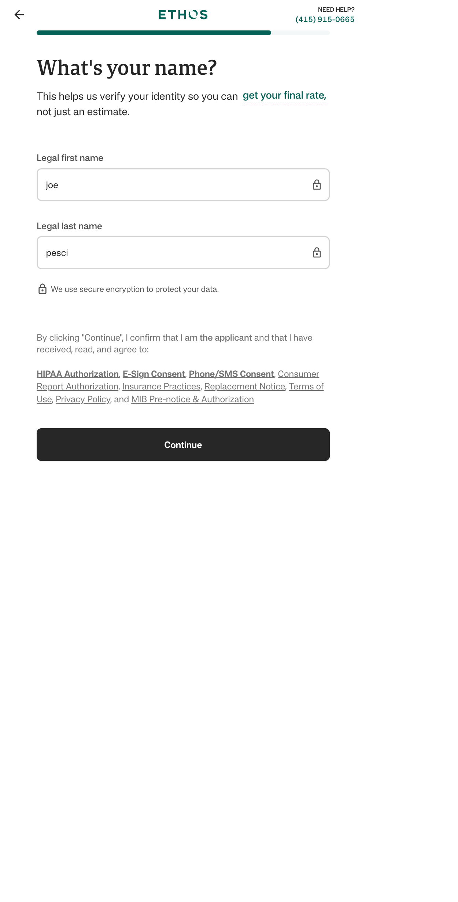

---

## Screen 22

**URL:** https://app.ethos.com/q/email

### What the user sees
The screen shows the **ETHOS** logo centered at the top, with "NEED HELP? (415) 915-0665" in the top-right corner and a back arrow in the top-left. A green progress bar spans most of the width near the top, indicating the funnel is nearly complete.

The main heading reads **"What's your email?"** in large bold text. Below it is a text input field with placeholder text "example@ethos.com" and a lock icon on the right edge.

Beneath the input is a **reCAPTCHA** widget with a checkbox, the label "I'm not a robot," the reCAPTCHA logo, and links to "Privacy" and "Terms."

A security notice reads: "We use secure encryption to protect your data." (with a lock icon).

Below that: "Already have an account? **Log in**" where "Log in" is styled as a teal link.

At the bottom of the screen is a greyed-out **"Next"** button (disabled state, indicating the form is not yet complete).

### What the user can do
- **Email text input** — Enter an email address; placeholder shows "example@ethos.com"
- **reCAPTCHA checkbox** — Check "I'm not a robot" to complete the bot verification
- **"Log in" link** — Navigates existing account holders to a login flow
- **"Privacy" link** (within reCAPTCHA) — Opens Google's reCAPTCHA privacy policy
- **"Terms" link** (within reCAPTCHA) — Opens Google's reCAPTCHA terms of service
- **"Next" button** — Submits the email and advances to the next step (currently disabled until the form is valid)
- **Back arrow** — Returns to the previous screen in the funnel

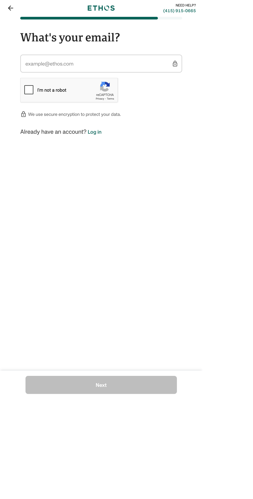

---

## Screen 23

**URL:** https://app.ethos.com/verify

### What the user sees
A full-screen dark teal/green background with a circular spinner animation centered vertically on the screen, accompanied by the text "Loading..." below it. No other content, branding, or navigation is visible.

### What the user can do
There are no interactive elements on this screen. The user can only wait for the loading state to complete.

---

## Screen 24

**URL:** https://app.ethos.com/verify

### What the user sees
The screen displays the **Ethos** logo in the top-left and a "NEED HELP? (415) 915-0665" link in the top-right. The main heading reads **"What is your primary residential address?"** followed by supporting text: "This helps us verify your identity so you can **get your final rate**, not just an estimate." The phrase "get your final rate" appears as a teal/green hyperlink. Below that, two selectable options are displayed as cards:
1. **27 Lakehill Ave, Arlington, MA 02474**
2. **None of the above**

A "Next" button appears at the bottom of the screen in a dark/black pill-shaped button.

### What the user can do
- **"27 Lakehill Ave, Arlington, MA 02474" card** — selectable option; choose this if the pre-filled address is correct
- **"None of the above" card** — selectable option; choose this if the address shown is not the user's primary residence
- **"get your final rate" link** — inline hyperlink; likely provides more context about the rate process
- **"Next" button** — proceeds to the next step after selecting an address option
- **"(415) 915-0665" link** — calls or contacts Ethos support

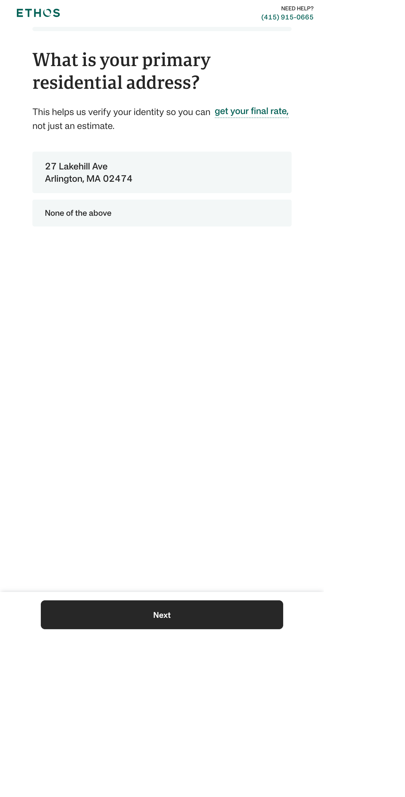

---

## Screen 25

**URL:** https://app.ethos.com/verify

### What the user sees
- **Top bar:** Ethos logo (top-left), "NEED HELP? (415) 915-0665" (top-right)
- **Heading:** "What is your primary residential address?"
- **Subheading:** "Confirming your address helps you skip the medical exam."
- **Form fields:** Two labeled inputs side by side — "Street address" (wider, placeholder: "Street address, City, State") and "Apt/Suite" (narrower, placeholder: "Apt #")
- **Trust signal:** A lock icon with the text "We use secure encryption to protect your data."

### What the user can do
- **Street address input** — Enter full street address (City and State included); labeled "Street address"
- **Apt/Suite input** — Enter optional apartment or suite number; labeled "Apt/Suite"
- **Next button** — Disabled/grayed out at the bottom; proceeds to the next step once address is filled in
- **Phone number link** — "(415) 915-0665" in the top-right; tapping calls customer support

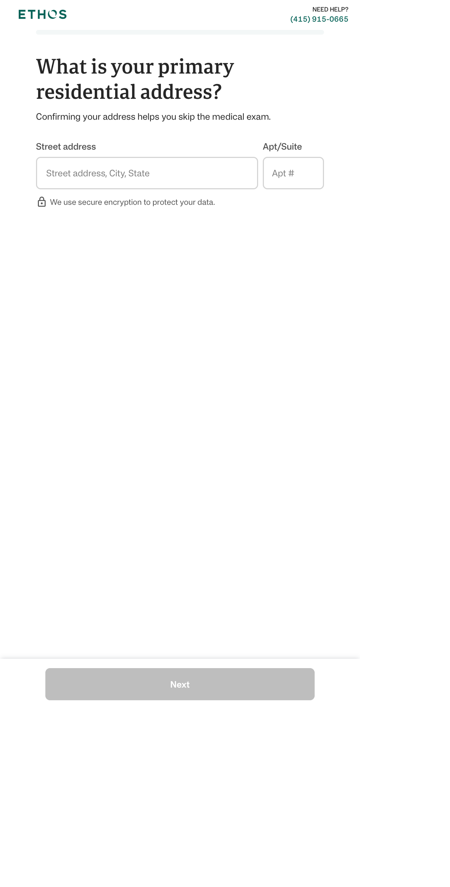

---

## Screen 26

**URL:** https://app.ethos.com/verify

### What the user sees
- **Header:** "ETHOS" logo (top left), "NEED HELP? (415) 915-0065" (top right)
- **Heading:** "What's your mobile phone number?"
- **Subheading:** "Insurance companies require this to provide coverage."
- **Field label:** "Mobile phone number"
- **Security note:** A lock icon followed by "We use secure encryption to protect your data."
- **Info banner:** A blue-tinted box with a pin icon and the text: "Note: A mobile number is required. Landline and other non-mobile numbers will fail verification and require you to provide a government ID."

### What the user can do
- **Mobile phone number input** — Text field with placeholder "(555) 123-4567"; accepts a mobile phone number
- **Next button** — Disabled/greyed-out button at the bottom labeled "Next"; submits the phone number and advances to the next step

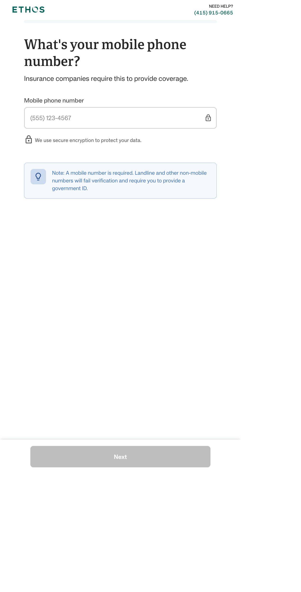

---

## Screen 27

**URL:** https://app.ethos.com/verify

### What the user sees
- **Top navigation bar**: "ETHOS" logo (top left), "NEED HELP? (415) 915-0665" (top right)
- **Error/warning banner** (orange-red background with warning icon): "This number doesn't seem to be in your name. Use a number you own for quick text code verification, or you may have to verify with a photo ID."
- **Main heading**: "Please enter a mobile number that belongs to you"
- **Subheading**: "Insurance companies require this to provide coverage."
- **Field label**: "Mobile phone number"
- **Input field**: Text input with placeholder "(555) 123-4567" and a lock icon on the right
- **Note**: "Note: Landlines are not supported."
- **Security note** (with lock icon): "We use secure encryption to protect your data."
- **Footer button**: "Next" (gray, full-width)

### What the user can do
- **Mobile phone number input**: Enter a mobile phone number; accepts numeric input in the format (555) 123-4567
- **"Next" button**: Submit the entered phone number and proceed to the next step (currently appears inactive/gray)
- **Phone link "415-915-0665"**: Call customer support

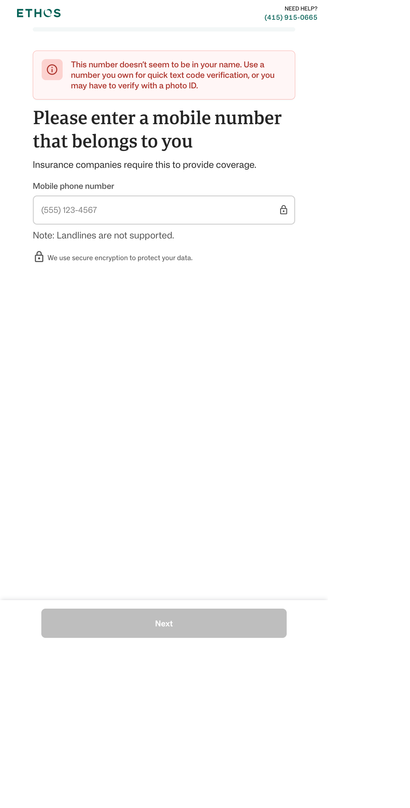

---

## Screen 28

**URL:** https://app.ethos.com/verify

### What the user sees
- **Header:** Ethos logo (top left), "NEED HELP? (415) 915-0665" (top right)
- **Heading:** "Please enter a mobile number that belongs to you"
- **Subheading:** "Insurance companies require this to provide coverage."
- **Input field label:** "Mobile phone number" with placeholder "(555) 123-456?"
- **Error message (in red):** "It looks like this number is registered under someone else's name. Please provide another number."
- **Note:** "Note: Landlines are not supported."
- **Trust indicator:** Lock icon followed by "We use secure encryption to protect your data."
- **Footer button area:** "Next" button (grayed out/disabled)

### What the user can do
- **Mobile phone number input** — Text field to enter a mobile phone number; currently showing a validation error indicating the entered number is registered under someone else's name
- **Clear/reset button** — Small icon (circle with X) on the right side of the phone input field, used to clear the entered value
- **Next button** — Disabled/grayed out button at the bottom; advances to the next step once a valid number is entered
- **Phone link:** "(415) 915-0665" in the header — callable help line link

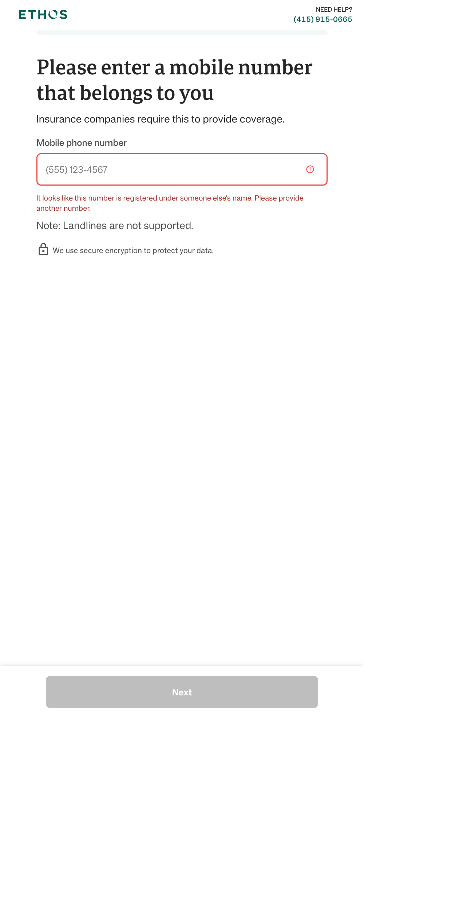

---

## Screen 29

**URL:** https://app.ethos.com/verify

### What the user sees

**Header:** "ETHOS" logo (top left) and "NEED HELP? (415) 915-0665" (top right).

**Heading:** "Let's quickly confirm it's really you"

**Subtext:** "To continue with your application, you need to upload a picture of a government-issued Photo ID. It helps keep your application secure and will get your final, approved rates faster."

**Trust indicator:** A lock icon followed by "Your information is secured with bank-level encryption."

**Step 1 — "Upload a photo of a valid government ID"**
Body text: "Your ID must not be expired and include your legal name, date of birth, and a photo. Most people use their driver's license or passport."
Visual: An illustration of a government ID card labeled "GOVERNMENT ID" showing a placeholder photo and sample fields (First Name: John, Last Name: Doe, DOB: 4/15/1977).

**Step 2 — "Take a selfie"**
Body text: "Make sure your background is clear and you have bright lighting on your face."
Visual: An illustration of a selfie capture frame with a placeholder person icon inside.

---

### What the user can do

- **"Next" button** (bottom, full-width, black) — advances to the next step, presumably initiating the ID upload or selfie capture flow.

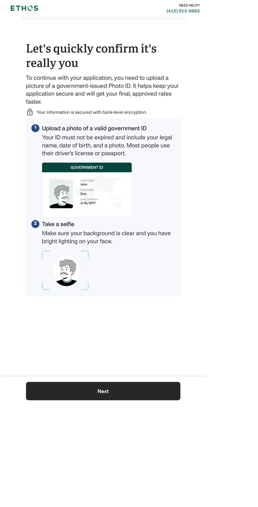

---

